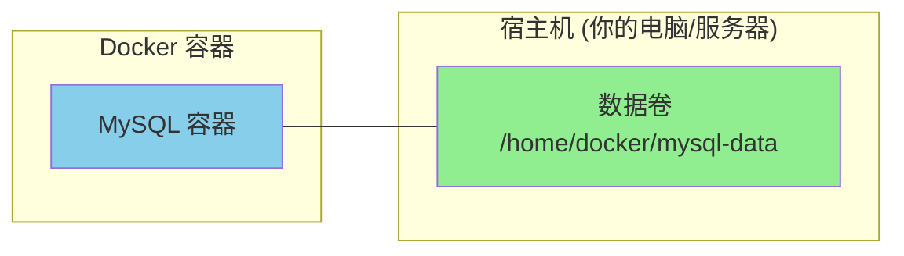

# Docker 数据卷

## 什么是数据卷

想象一下，你有一个 **docker 容器**，就像一个**临时住房**。当你退房时，房间里的所有东西都会被清空。

但是，有些数据是你不想丢掉的，比如：
- MySQL 数据库里的数据
- 网站上传的文件
- 配置文件

**数据卷（Volume）** 就是 Docker 提供的「**保险箱**」。你把重要的东西放进保险箱，就算容器消失了，东西还在。

### 一图理解数据卷



### 为什么需要数据卷？

| 场景 | 没有数据卷 | 有数据卷 |
|------|-----------|---------|
| 容器被删除 | 数据全部丢失 | 数据依然存在 |
| 容器升级/重建 | 数据全部丢失 | 数据依然存在 |
| 多容器共享数据 | 麻烦且易出错 | 方便共享 |

## 数据卷的基本操作

### 创建数据卷

```bash
docker volume create my-volume
```

这就是创建一个叫 `my-volume` 的保险箱。

| 参数 | 说明 |
|------|------|
| `my-volume` | 数据卷的名称，可以自定义 |

### 查看数据卷

```bash
# 查看所有数据卷
docker volume ls

# 查看某个数据卷的详细信息
docker volume inspect my-volume
```

### 查看数据卷是否被挂载

数据卷是否被使用，关键看它有没有被容器挂载。

```bash
# 方法1：查看所有容器及其挂载情况
docker ps -a

# 方法2：查看具体某个容器的完整挂载信息
docker inspect 容器名称

# 方法3：用 grep 过滤挂载信息
docker inspect 容器名称 | grep -A 10 Mounts
```

### 查看已挂载的数据卷

结合 `docker volume ls` 和容器检查：

```bash
# 查看所有数据卷的使用情况
docker volume ls -f dangling=false
```

### 删除数据卷

```bash
docker volume rm my-volume
```

### 清理未使用的数据卷

```bash
docker volume prune
```

这个命令会删除**所有未被容器使用**的数据卷，相当于"大扫除"。

::: warning 注意
执行此命令前请确认哪些数据卷不再需要，删除后数据无法恢复。
:::

