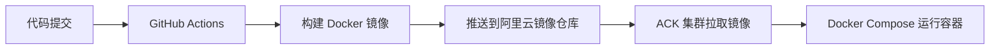

# Docker Compose 基础入门

## 什么是 Docker Compose

Docker Compose 是一个用于定义和管理多容器应用的工具。通过一个 `docker-compose.yml` 配置文件，你可以同时启动、停止和管理多个 Docker 容器。

**解决的问题：**
- 手动启动多个容器命令繁琐
- 容器之间的依赖关系难以管理
- 环境配置分散在多个命令中

**核心概念：**
- **services（服务）**：代表一个容器
- **volumes（卷）**：持久化数据
- **networks（网络）**：容器间通信

**简单示例：**
```yaml
services:
  web:
    image: nginx
    ports:
      - "80:80"
  db:
    image: mysql:8
    environment:
      MYSQL_ROOT_PASSWORD: 123456
```

一行命令即可启动全部服务：`docker-compose up`

## 后端服务部署架构

**整体流程：**



**核心组件：**
- **GitHub Actions**：自动化构建和推送镜像
- **阿里云容器镜像服务（ACR）**：存储 Docker 镜像
- **Docker Compose**：在 ACK 节点上编排容器

**部署流程简述：**
1. 代码推送后，GitHub Actions 自动构建 Docker 镜像
2. 镜像推送到阿里云容器镜像仓库
4. 使用 Docker Compose 拉取服务镜像

## GitHub Actions 配置详解

```yaml
name: Docker 打包构建发布

on:
  push:
    branches:
      - master

jobs:
  build-and-deploy:
    runs-on: ubuntu-latest
    steps:
      # 1. 拉取 GitHub 上的代码
      - name: Checkout code
        uses: actions/checkout@v4

      # 2. 登录阿里云容器镜像服务（ACR）
      - name: Login to Alibaba Cloud ACR
        uses: aliyun/acr-login@v1
        with:
          login-server: ${{ secrets.ALIYUN_REGISTRY_SERVER }}
          username: ${{ secrets.ALIYUN_REGISTRY_USERNAME }}
          password: ${{ secrets.ALIYUN_REGISTRY_PASSWORD }}

      # 3. 设置日期和 SHA
      - name: Set tags
        id: tags
        run: echo "sha=${GITHUB_SHA:0:10}" >> $GITHUB_OUTPUT && echo "date=$(date +%Y%m%d)" >> $GITHUB_OUTPUT

      # 4. 构建并推送 Docker 镜像到阿里云 ACR
      - name: Build and push Docker image
        uses: docker/build-push-action@v6
        with:
          context: .
          push: true
          tags: ${{ secrets.ALIYUN_REGISTRY_SERVER }}/${{ secrets.ALIYUN_NAMESPACE }}/agentflow:latest

      - name: Deploy to Server
        uses: appleboy/ssh-action@master
        with:
          host: ${{ secrets.SERVER_IP }}
          username: root
          key: ${{ secrets.SSH_PRIVATE_KEY }}
          script: |
            # 登录阿里云镜像仓库
            docker login --username=${{ secrets.ALIYUN_REGISTRY_USERNAME }} --password=${{ secrets.ALIYUN_REGISTRY_PASSWORD }} ${{ secrets.ALIYUN_REGISTRY_SERVER }}
            cd /docker
            docker compose pull
            docker compose up -d --force-recreate
```

需要在 GitHub 仓库 `Settings > Secrets` 中配置：
- `ALIYUN_REGISTRY_SERVER`：阿里云镜像仓库地址
- `ALIYUN_REGISTRY_USERNAME`：阿里云账号
- `ALIYUN_REGISTRY_PASSWORD`：阿里云密码
- `ALIYUN_NAMESPACE`：命名空间
- `SERVER_IP`：服务器 IP
- `SSH_PRIVATE_KEY`：SSH 私钥

## Dockerfile 配置详解

```dockerfile
# 使用 node:22-alpine 作为基础镜像 并命名为 builder
FROM node:22-alpine as builder

# 设置工作目录
WORKDIR /app

# 复制项目依赖文件到容器的 工作 目录
COPY package.json pnpm-*.yaml ./

# 安装 pnpm
RUN npm install -g pnpm

# 安装项目依赖
RUN pnpm install

# 复制项目所有代码到容器的 工作 目录
COPY . .

# 编译 NestJS 项目
RUN pnpm build

# 第二阶段
FROM node:22-alpine as runner

# 设置工作目录
WORKDIR /app

# 复制编译阶段生成的依赖文件（只复制生产依赖，减少体积）
COPY --from=builder /app/package*.json /app/pnpm-*.yaml ./

# 安装 pnpm
RUN npm install -g pnpm

# 安装项目依赖
RUN pnpm install --only=production

# 复制编译阶段生成的 dist 目录
COPY --from=builder /app/dist ./dist

# 暴露端口
EXPOSE 3000

# 安装 PM2
RUN npm install -g pm2

# 复制 PM2 配置文件
COPY pm2.config.js ./

# 用 pm2-runtime 启动（适配容器环境，避免容器退出）
CMD ["pm2-runtime", "start", "pm2.config.js"]
```

**核心要点：**
- **多阶段构建**：第一阶段编译，第二阶段只复制运行时文件，最终镜像体积更小
- **pnpm install --only=production**：只安装生产依赖，不安装开发依赖
- **PM2**：用 `pm2-runtime` 启动，适配容器环境，避免容器退出

## 阿里云添加容器镜像服务

### 第一步：进入容器镜像服务控制台


进入阿里云容器镜像服务控制台，这里可以管理镜像仓库、命名空间等资源。

### 第二步：创建命名空间


点击「创建命名空间」，填写名称（如 `lhc123456`）。命名空间用于分组管理多个镜像仓库。

### 第三步：创建镜像仓库


点击「创建镜像仓库」，选择刚才创建的命名空间，填写仓库名称（如 `agentflow`）。仓库创建完成后会显示仓库地址，供 GitHub Actions 推送镜像使用。

## 服务器端 docker-compose.yml 配置

在服务器根目录创建 `/docker/docker-compose.yml` 文件：

```yaml
version: '3.8'

services:
  # 后端服务
  backend:
    image: crpi-9b1idnnx82y0du6c.cn-shanghai.personal.cr.aliyuncs.com/agentflow_be/agentflow:latest
    restart: always
    ports:
      - "3000:3000"
    networks:
      - AgentFlow
    environment:
      - TZ=Asia/Shanghai
    logging:
      driver: "json-file"
      options:
        max-size: "10m"
        max-file: "3"

networks:
  AgentFlow:
```

**核心配置说明：**
- **image**：阿里云镜像仓库地址和标签
- **restart: always**：容器异常退出后自动重启
- **networks**：使用共享网络让前后端互通
- **logging**：日志轮转，单文件最大 10M，保留 3 个文件

## Nginx HTTPS 反向代理配置

在 Nginx 配置目录中添加反向代理配置：

```nginx
server {
  if ($host = intra.lihaichao.cn) {
      return 301 https://$host$request_uri;
  } # managed by Certbot

  listen 80;
  server_name intra.lihaichao.cn;
  # HTTP 自动跳 HTTPS
  return 301 https://$host$request_uri;
}


# HTTPS 反向代理到后端 3000
server {
    listen 443 ssl;
    server_name intra.lihaichao.cn;

    ssl_certificate /etc/letsencrypt/live/intra.lihaichao.cn/fullchain.pem;
    ssl_certificate_key /etc/letsencrypt/live/intra.lihaichao.cn/privkey.pem;

    location / {
        proxy_pass http://127.0.0.1:3000;
        proxy_set_header Host $host;
        proxy_set_header X-Real-IP $remote_addr;
        proxy_set_header X-Forwarded-For $proxy_add_x_forwarded_for;
        proxy_set_header X-Forwarded-Proto $scheme;
    }
}
```

**配置说明：**
- **listen 443 ssl**：监听 443 端口并启用 SSL
- **server_name**：访问的域名
- **ssl_certificate**：SSL 证书路径
- **proxy_pass http://127.0.0.1:3000**：将请求转发到后端服务
- **proxy_set_header**：传递真实客户端 IP 和协议信息

